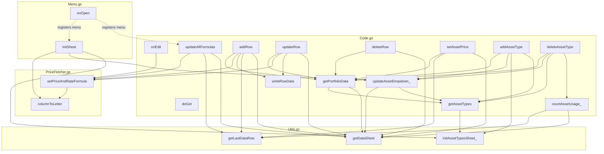
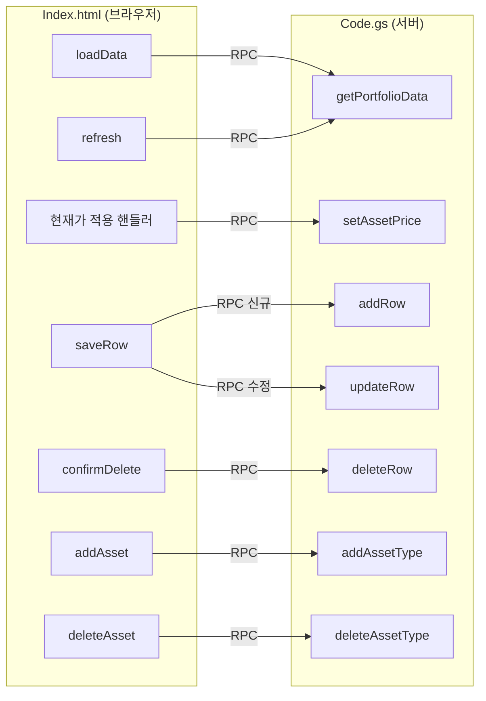

# 의존성 그래프

## 파일 단위 의존 방향

```
Index.html (클라이언트)
      │ google.script.run (RPC — 컴파일 타임 검증 없음)
      ▼
Code.gs ──────────┐
      │            │
      ▼            ▼
Menu.gs      PriceFetcher.gs
      │            │
      └─────┬──────┘
            ▼
        Utils.gs
```

- `Utils.gs`는 다른 어떤 `.gs` 파일도 호출하지 않는다 — 가장 아래 계층.
- `PriceFetcher.gs`는 `Utils.gs`가 정의한 상수(`COL_*`)만 참조하고, 함수 호출 의존은 없다.
- `Code.gs`와 `Menu.gs`는 `Utils.gs`와 `PriceFetcher.gs`를 호출하지만, 서로를 호출하지는 않는다.
- **순환 의존 없음.**

## 함수 호출 그래프 (서버 사이드)



## 클라이언트 → 서버 호출 그래프 (`google.script.run`)



## 고팬인(fan-in) 함수 — 변경 시 영향 범위가 넓은 함수

| 함수 | fan-in | 호출하는 곳 |
|------|--------|--------------|
| `getAssetTypes()` | 4 | `addAssetType`, `deleteAssetType`, `getPortfolioData`, `updateAssetDropdown_` |
| `updateAssetDropdown_()` | 3 | `addAssetType`, `deleteAssetType`, `initSheet` |
| `getDataSheet()` | 6 | `updateAllFormulas`, `getPortfolioData`, `addRow`, `updateRow`, `deleteRow`, `setAssetPrice`, `updateAssetDropdown_`, `countAssetUsage_` (Utils.gs 정의, 서버 함수 대부분이 의존) |
| `getPortfolioData()` | 6 | `addRow`, `updateRow`, `deleteRow`, `setAssetPrice`, `addAssetType`, `deleteAssetType` 반환값으로 사용, 클라이언트의 `loadData`/`refresh`가 직접 RPC 호출 |

이 표에 있는 함수의 시그니처(파라미터·반환 형식)를 바꾸면, 나열된 모든 호출부를 함께 점검해야 한다.

## 서드파티/외부 의존성

없음. Apps Script 내장 서비스(`SpreadsheetApp`, `HtmlService`)만 사용하며, `package.json`이나 외부 라이브러리가 없다.
